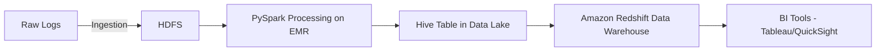

# End-to-End Big Data Processing with Hadoop & Spark

## 📌 Overview

This project demonstrates an **end-to-end big data analytics pipeline** that ingests large-scale web server log data, processes it using **Hadoop (HDFS)** and **Apache Spark**, transforms and aggregates the data using **SparkSQL** and **HiveQL**, and finally loads it into **Amazon Redshift** for BI reporting and dashboard creation.

The architecture is designed to handle **petabyte-scale data**, leverage **distributed computing** for performance, and support **real-time and batch analytical queries** for business decision-making.

---

## 🎯 Objectives

1. **Ingest & Store** massive raw log data from multiple sources into **HDFS**.
2. **Process & Clean** the data using PySpark transformations for structured analysis.
3. **Enrich & Aggregate** data using SparkSQL & HiveQL.
4. **Model & Load** the cleaned data into **Amazon Redshift**.
5. **Visualize Insights** using dashboards (e.g., Tableau, QuickSight).

---

## 🏗️ Architecture



**Components:**

* **HDFS** — Distributed storage for raw and processed data.
* **PySpark on EMR** — Scalable processing engine for data cleaning, transformation, and aggregation.
* **Hive Metastore** — Centralized schema repository for structured queries on HDFS data.
* **Amazon Redshift** — Columnar data warehouse for analytical queries.
* **BI Tools** — Visual dashboards to communicate results.

---

## 📂 Repository Structure

```
.
├── README.md
├── ingestion_pipeline.py        # Hadoop ingestion logic
├── spark_processing.py          # PySpark transformation & aggregation
├── hive_queries.sql             # HiveQL scripts for table creation & queries
├── redshift_loader.py           # ETL into Amazon Redshift
├── sample_logs.csv               # 200+ rows sample dataset
└── dashboards/                  # Exported Tableau/QuickSight dashboard files
```

---

## ⚙️ Data Flow

1. **Ingestion** — Logs ingested via **Flume** or **Kafka** and stored in **HDFS** partitions.
2. **Processing** — PySpark script cleans and parses logs into structured DataFrames.
3. **Aggregation** — SparkSQL & HiveQL queries compute metrics (e.g., daily active users, clickstream funnel).
4. **Load to Redshift** — Data is written to **S3** and then loaded into Redshift using `COPY` commands.
5. **Visualization** — Dashboards display KPIs like traffic sources, error rates, and regional activity.

---

## 🛠️ Technologies Used

* **Apache Hadoop (HDFS)**
* **Apache Spark (PySpark, SparkSQL)**
* **Amazon EMR**
* **Apache Hive**
* **Amazon Redshift**
* **AWS S3**
* **Tableau / AWS QuickSight**
* **Python 3.x**
* **Boto3 (AWS SDK for Python)**

---

## 📊 Example Metrics Generated

* **Traffic Volume** — Page views, sessions, and unique visitors per hour/day/week.
* **Error Analysis** — HTTP error rates by type (404, 500).
* **Geo Analytics** — Traffic and performance by region.
* **Top Content** — Pages and categories generating the most engagement.

---

## 🚀 Deployment Steps

### 1️⃣ Launch EMR Cluster

* Hadoop 3.x, Spark 3.x, Hive 3.x.
* Auto-scaling enabled.

### 2️⃣ Data Ingestion

```bash
hdfs dfs -put sample_logs.csv /data/raw/
```

### 3️⃣ Run Spark Processing

```bash
spark-submit spark_processing.py
```

### 4️⃣ Execute Hive Queries

```bash
hive -f hive_queries.sql
```

### 5️⃣ Load into Redshift

```bash
python redshift_loader.py
```

---

## 🛡️ Data Quality & Governance

* **Schema Enforcement** — Hive Metastore ensures type consistency.
* **Partition Pruning** — Optimized query performance in Spark and Hive.
* **Data Validation** — Row count checks, null value monitoring before Redshift load.

---

## 📈 Dashboard Examples

1. **Traffic by Region** — Interactive map view.
2. **Error Trends** — Time-series breakdown of error rates.
3. **Top Performing Pages** — Sorted by engagement and conversions.

---

## 📌 Next Steps

* Implement **real-time processing** with Spark Structured Streaming.
* Add **machine learning models** for anomaly detection.
* Integrate **data quality monitoring dashboards**.

---

## 👤 Author

**Kiran Ranganalli**
📧 Email: [kiranranganalli@gmail.com](mailto:kiranranganalli@gmail.com)
🔗 [LinkedIn](https://linkedin.com/in/kiranranganalli)
